# Human Heart

**Interactive Cardiac Anatomy** · Three.js · WebGL 2 · GLSL · sem build


> Visualização anatômica educacional. Não destinada a diagnóstico médico,
> planejamento cirúrgico ou decisão clínica.

## Descrição

Um coração humano 3D **anatômico** e interativo, que roda no navegador direto de
arquivos estáticos. O modelo vem do **BodyParts3D**, um banco científico de
anatomia feito a partir de ressonância magnética de uma pessoa real e revisado
por ilustradores médicos (ver [origem e licença](docs/MODEL_LICENSE.md)). Nada
aqui é um "♥" estilizado, uma nuvem de partículas ou um conjunto de esferas: as
paredes, as quatro cavidades, as valvas com suas cordas tendíneas, os músculos
papilares, as artérias e veias coronárias ramo a ramo e os grandes vasos estão
onde estão no corpo.

O coração bate continuamente seguindo as fases reais do ciclo cardíaco
(enchimento, contração atrial, atraso no nó AV, contração ventricular, ejeção,
relaxamento), com tempos tirados de medições em pessoas. A frequência vai de
**40 a 180 BPM** e tudo acompanha: músculo, valvas, fluxo sanguíneo, fluxo
coronariano, sistema elétrico, ECG e o som "tum-tá".

Ao **aproximar a câmera**, o coração se abre aos poucos, sem cortes: o epicárdio
e a gordura somem, o miocárdio fica translúcido só em volta da linha de visão, e
aparecem câmaras, septos, valvas, cordas tendíneas e músculos papilares.

A base técnica é a do projeto [Black-Hole](https://github.com/Helio965/Black-Hole):
mesmo carregamento do Three.js sem npm, mesmo pós-processamento, mesma detecção
da placa de vídeo, mesmos perfis de qualidade adaptativos e o mesmo iniciador
`iniciar.bat` para Windows.

## Sumário

- [Demonstração](#demonstração)
- [Funcionalidades](#funcionalidades)
- [Tecnologias utilizadas](#tecnologias-utilizadas)
- [Como executar](#como-executar)
- [Travando? Use a placa de vídeo dedicada](#travando-use-a-placa-de-vídeo-dedicada)
- [Controles](#controles)
- [Anatomia representada](#anatomia-representada)
- [Batimento e BPM](#batimento-e-bpm)
- [Visualização interna por aproximação](#visualização-interna-por-aproximação)
- [Fluxo sanguíneo e circulação coronariana](#fluxo-sanguíneo-e-circulação-coronariana)
- [Sistema elétrico](#sistema-elétrico)
- [Som](#som)
- [Qualidade e desempenho](#qualidade-e-desempenho)
- [Estrutura do projeto](#estrutura-do-projeto)
- [Como funciona](#como-funciona)
- [Regenerar o modelo](#regenerar-o-modelo)
- [Testes](#testes)
- [Fontes](#fontes)
- [Limitações conhecidas](#limitações-conhecidas)
- [Licença e atribuição](#licença-e-atribuição)

## Demonstração

| | |
| --- | --- |
| 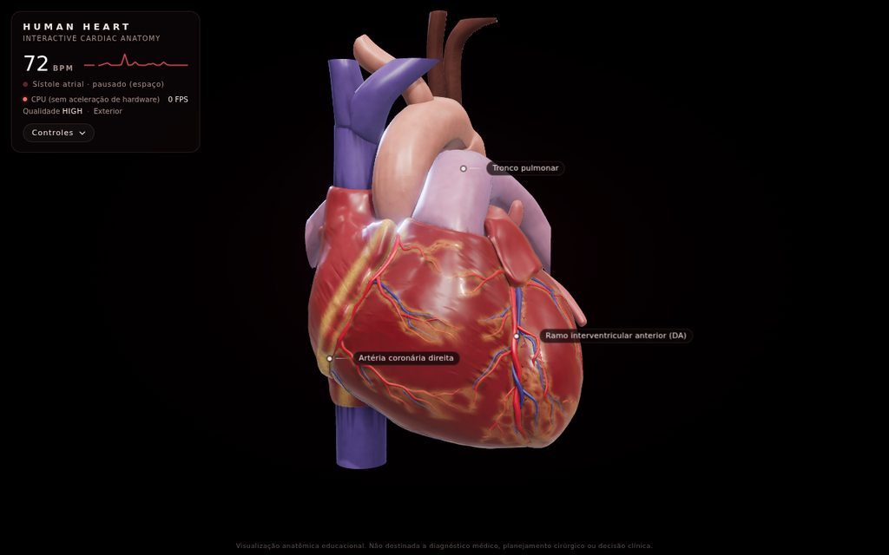 | 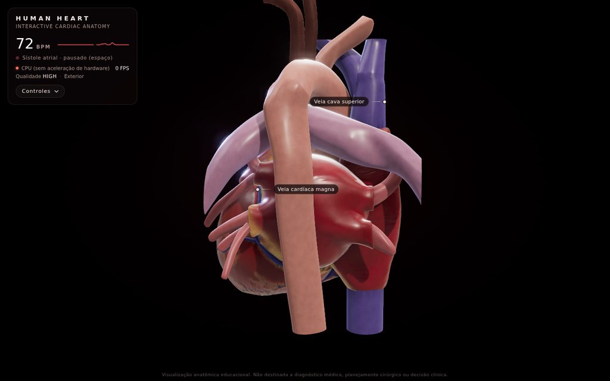 |
| **Anterior** — coronária direita no sulco AV, DA no sulco interventricular anterior, gordura nos sulcos | **Posterior** — aorta descendente, veias pulmonares chegando ao átrio esquerdo, veias cavas |
| 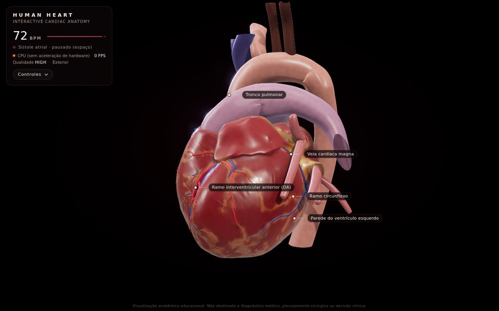 | 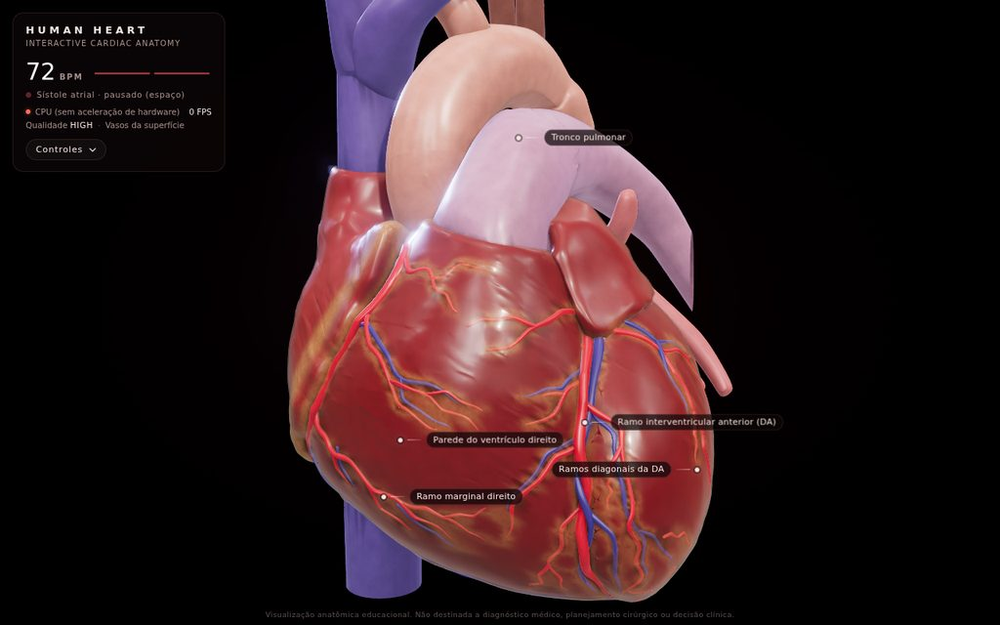 |
| **Lateral esquerda** — aurícula esquerda, circunflexa e veia cardíaca magna | **Nível 1** — ao aproximar, os vasos da superfície ganham destaque |
| 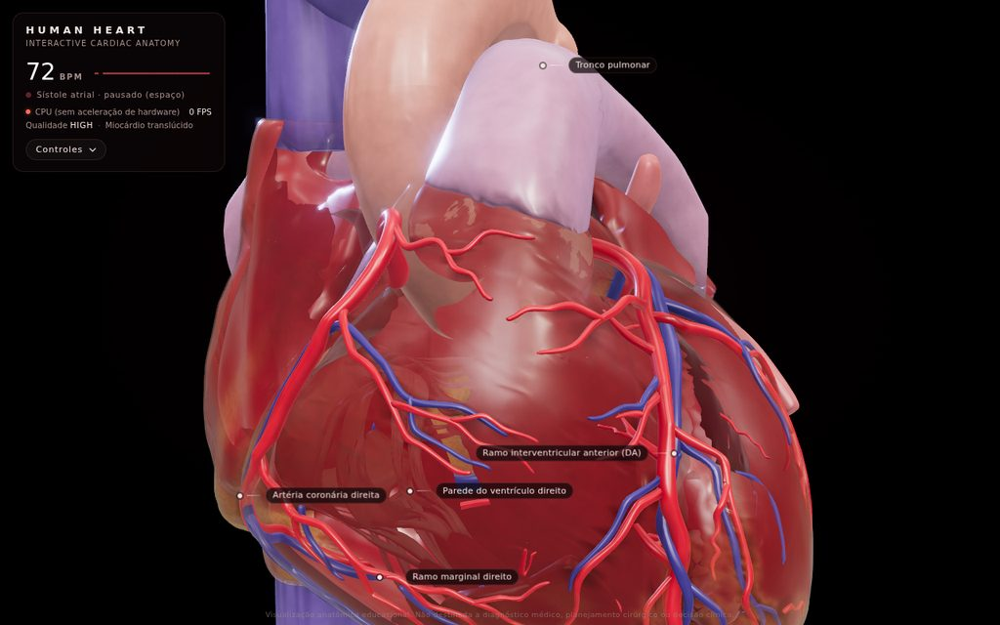 | 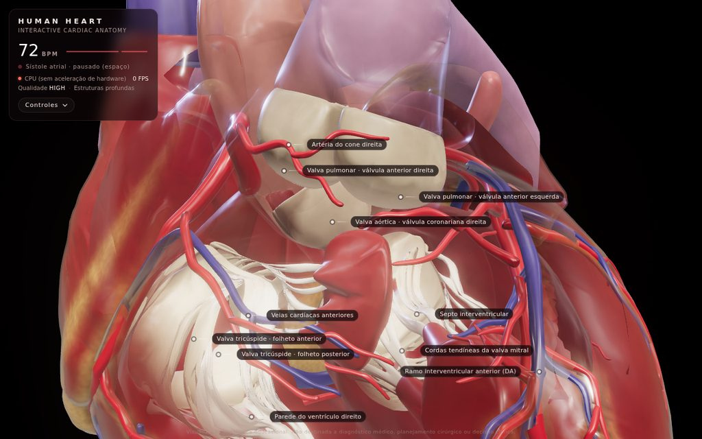 |
| **Nível 2** — o epicárdio some e o miocárdio começa a abrir em volta da linha de visão | **Nível 3** — valvas, cordas tendíneas, septos e músculos papilares |
| 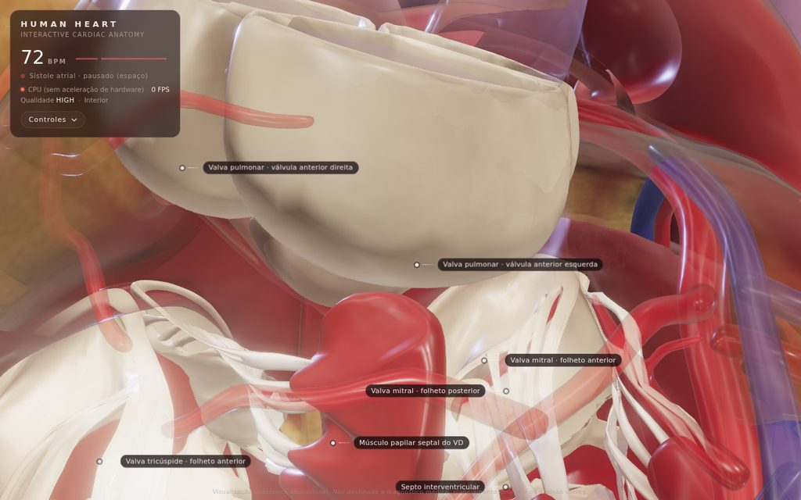 | 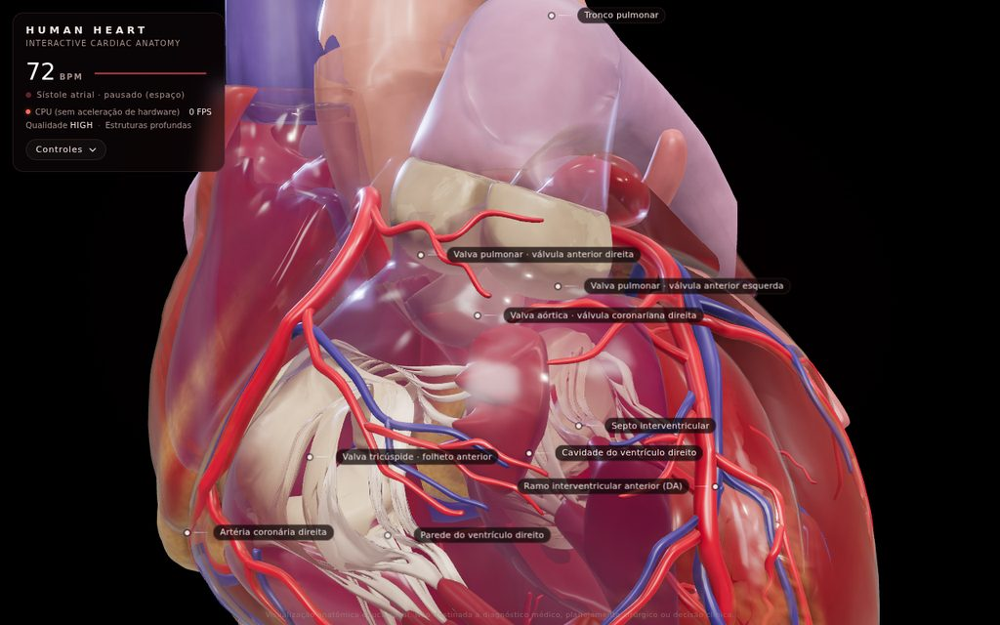 |
| **Nível 4** — dentro do coração: válvulas pulmonares, folhetos mitrais, papilar septal do VD | **Câmaras** — volumes de sangue das cavidades por dentro das paredes |
| 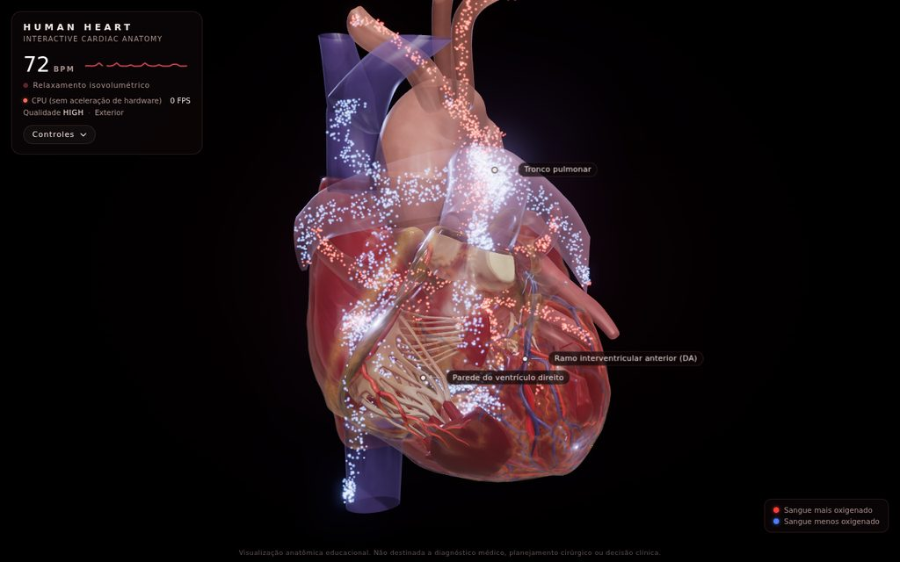 | 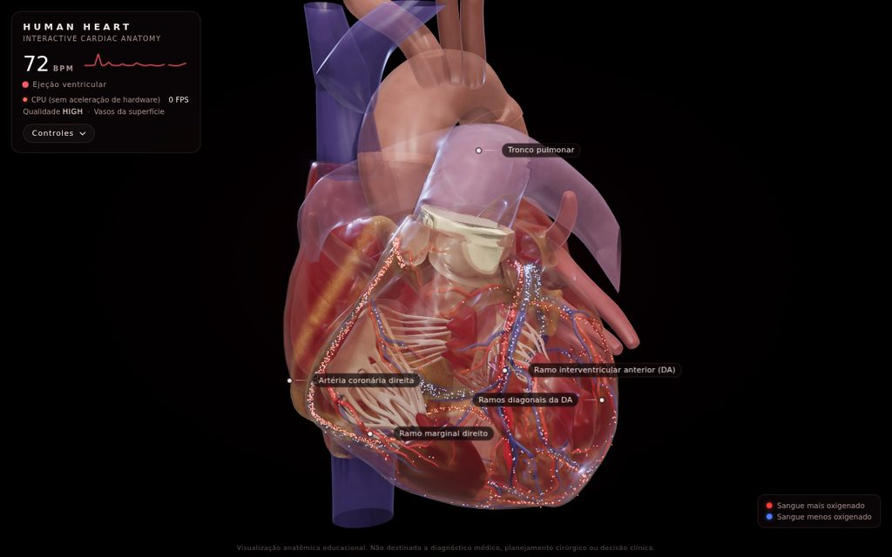 |
| **Fluxo sanguíneo** — azul (menos oxigenado) pelo lado direito até o tronco pulmonar, vermelho (mais oxigenado) das veias pulmonares à aorta | **Circulação coronariana** — artérias enchendo na diástole, veias drenando no seio coronário |
| 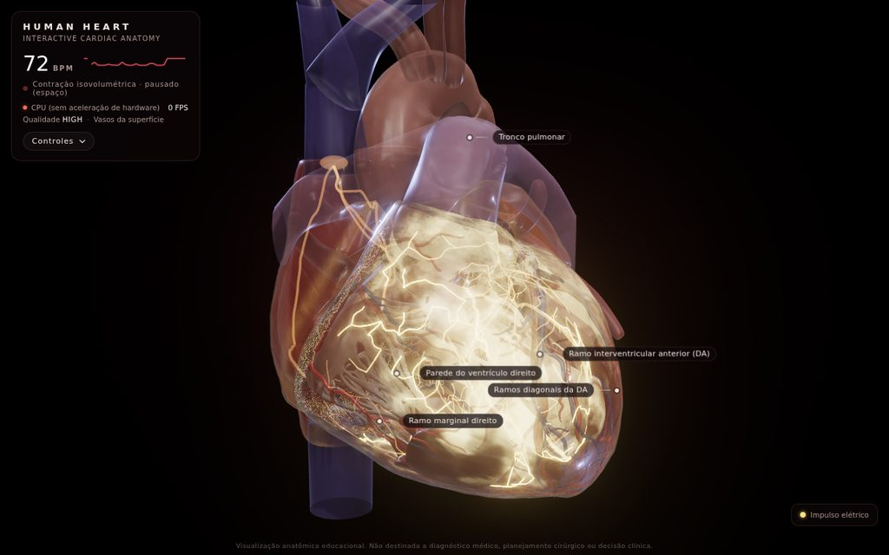 | 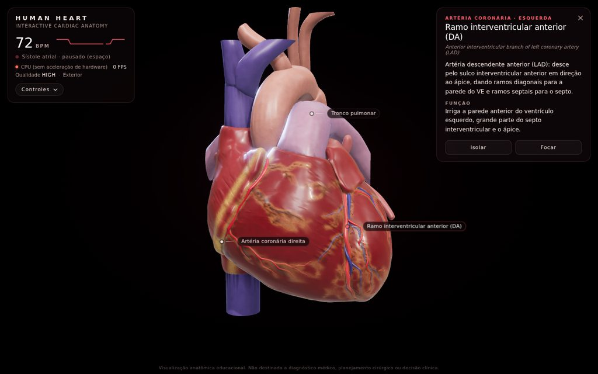 |
| **Sistema elétrico** — a onda de despolarização percorrendo os ventrículos pela rede de Purkinje | **Seleção** — nome, tipo, descrição e função da estrutura |
| 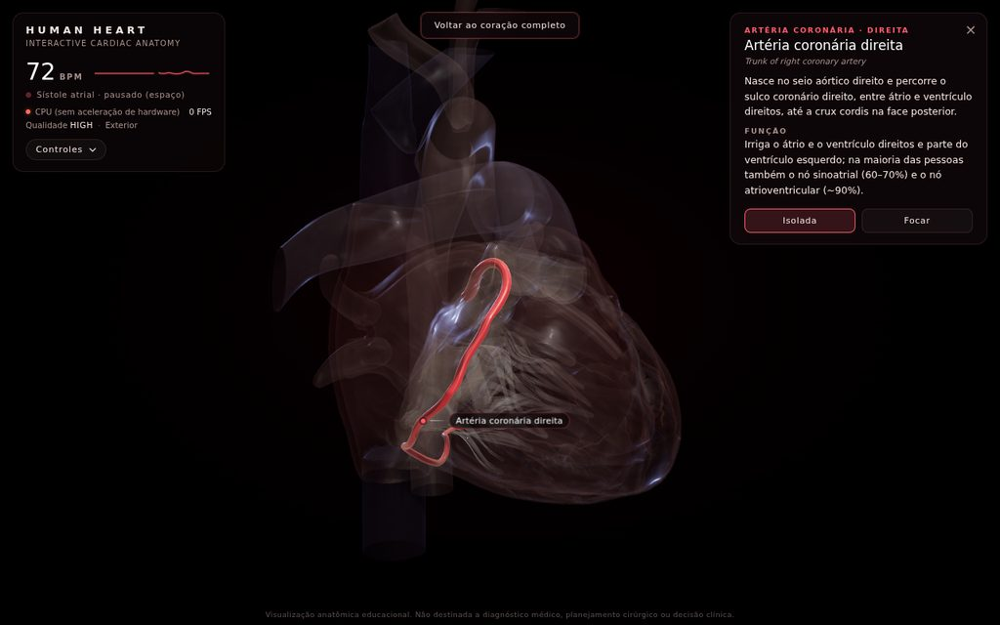 | 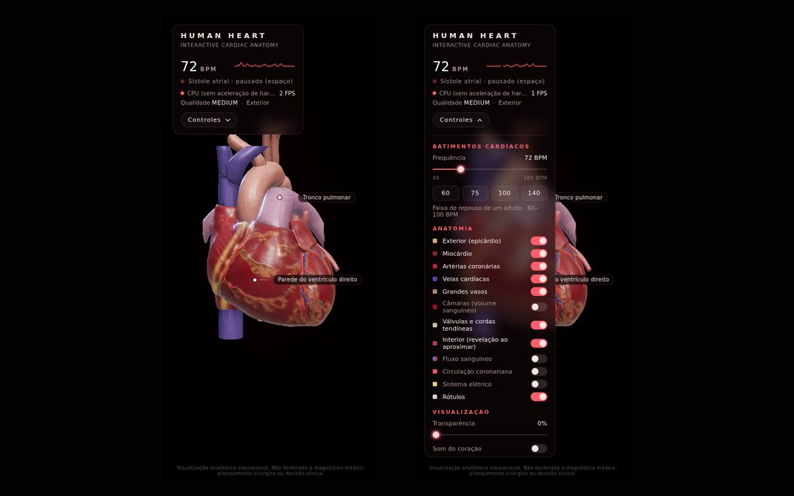 |
| **Isolar** — só a coronária direita em destaque; o resto fica translúcido | **Celular** — HUD compacto e controles por toque |

As imagens foram capturadas do próprio projeto (Chromium, perfil `high`).

## Funcionalidades

- **Coração anatômico real** (BodyParts3D, derivado de ressonância magnética),
  com materiais PBR próprios para miocárdio, átrios, epicárdio com gordura,
  artérias, veias, grandes vasos, valvas e cordas tendíneas.
- **Batimento fisiológico contínuo**: enchimento rápido, diástase, sístole
  atrial, contração isovolumétrica, ejeção e relaxamento isovolumétrico, com
  encurtamento longitudinal (o plano AV desce), contração radial com
  espessamento da parede, torção e contração atrial. Não é um `scale()`.
- **BPM de 40 a 180** (inicial 72) com presets **60 / 75 / 100 / 140**. A
  duração do ciclo é `60 / BPM` e as fases mudam como no corpo: a diástole
  encurta muito mais que a sístole. A troca de frequência é suave.
- **Valvas animadas** em sincronia com o ciclo: mitral e tricúspide abrem no
  enchimento e fecham no início da sístole; aórtica e pulmonar abrem na ejeção.
- **Rotação 360°** livre (mouse, toque), zoom até o interior e pan.
- **Visualização interna progressiva por aproximação** em 5 níveis, sem cortes.
- **Camadas anatômicas** que liga/desliga: exterior, miocárdio, artérias, veias,
  grandes vasos, câmaras, válvulas, interior, fluxo sanguíneo, circulação
  coronariana, sistema elétrico e rótulos.
- **Fluxo sanguíneo** com partículas: azul pelo lado direito até o tronco
  pulmonar, vermelho das veias pulmonares até a aorta, passando pelas valvas só
  quando elas estão abertas.
- **Circulação coronariana**: artérias coronárias (fluxo esquerdo
  predominantemente diastólico) e drenagem pelas veias cardíacas até o seio
  coronário e o átrio direito.
- **Sistema elétrico de condução**: nó SA, vias internodais e feixe de
  Bachmann, nó AV (com o atraso), feixe de His, ramos direito e esquerdo e rede
  de Purkinje, com a onda de despolarização percorrendo o músculo.
- **Seleção por Raycaster**: passar o mouse destaca, clicar mostra nome, nome em
  inglês, tipo, descrição e função; **Isolar** deixa só aquela estrutura e
  **Voltar ao coração completo** restaura. Clique duplo leva a câmera até o
  ponto.
- **Rótulos 3D** que acompanham o batimento, escolhidos por prioridade, zoom e
  visibilidade real (não rotulam o que está escondido atrás de outra estrutura)
  e que não se sobrepõem.
- **Som do coração** sintetizado (B1 "tum" e B2 "tá") ligado ao ciclo; muda o
  ritmo com o BPM sem acelerar um arquivo de áudio.
- **ECG simplificado** e nome da fase atual no HUD; **espaço** pausa o
  batimento para estudar uma fase.
- **Detecção da placa de vídeo** e **qualidade adaptativa** (AUTO, ULTRA, HIGH,
  MEDIUM, LOW), com o nome da GPU e o FPS no HUD e o passo a passo para usar a
  placa dedicada.
- **Níveis de detalhe**: modelo base e modelo subdividido (carregado nas GPUs
  mais fortes); ramos finos ganham destaque com o zoom, sem inventar vasos.
- **Abertura** inspirada nos vídeos de referência: partículas convergem para a
  superfície do coração, que então aparece e começa a bater.
- **Responsivo** (desktop e celular) e sem dependências para rodar.

## Tecnologias utilizadas

| Tecnologia | Uso |
| --- | --- |
| HTML5 + CSS3 | página, HUD, painel, cartão de informações, layout responsivo |
| JavaScript (ES Modules) | toda a lógica, sem frameworks e sem etapa de build |
| [Three.js r170](https://threejs.org/) | renderer WebGL 2, câmera, materiais PBR (`MeshPhysicalMaterial`), `GLTFLoader` + meshopt, `OrbitControls` |
| WebGL 2 + GLSL | trechos de shader injetados nos materiais (relevo, AO, SSS, revelação, onda elétrica), partículas, sistema de condução |
| `EffectComposer` + `UnrealBloomPass` + `OutputPass` | buffer HDR com MSAA, bloom e tone mapping |
| [three-mesh-bvh](https://github.com/gkjohnson/three-mesh-bvh) | seleção por raio acelerada que acompanha a deformação |
| WebAudio | bulhas B1/B2 sintetizadas e agendadas no relógio de áudio |
| glTF 2.0 (`KHR_mesh_quantization`, `EXT_meshopt_compression`) | formato do modelo, com blend shapes |
| PowerShell | servidor local do `iniciar.bat` (já vem no Windows) |
| Node.js (opcional) | só para regenerar o modelo (glTF-Transform, meshoptimizer, three-mesh-bvh) e rodar os testes (Playwright) |

Three.js e three-mesh-bvh são carregados via **importmap** a partir do jsDelivr.
Para usar o projeto não é preciso Node, npm nem nenhuma instalação.

## Como executar

> **Dois cliques no `index.html` não funcionam.** Os navegadores bloqueiam
> módulos JavaScript (ES Modules) e o carregamento do modelo 3D em arquivos
> abertos direto do disco (`file://`). Nesse caso a própria página mostra um
> aviso com as instruções abaixo. O projeto precisa ser aberto por um servidor
> local (`http://localhost`).

### Windows: dois cliques em `iniciar.bat`

1. Baixe o projeto (*Code → Download ZIP*) e extraia a pasta.
2. Dê dois cliques em **`iniciar.bat`**.
3. Na primeira vez, a janela preta pergunta se pode configurar o Windows para
   usar a **placa de vídeo de alto desempenho** no navegador. Aperte **Enter**
   (sim) ou digite `n`.
4. O projeto abre numa janela própria do Chrome (ou Edge), já pedindo a placa
   dedicada. Deixe a janela preta ("HUMAN HEART - servidor local") aberta
   enquanto usa o projeto e feche-a para parar.

O `iniciar.bat` roda `tools/servidor.ps1`, um mini servidor em PowerShell, que
já vem no Windows: **não é preciso instalar Node, npm nem Python**. Se o Windows
perguntar se pode executar o arquivo baixado, clique em *Mais informações →
Executar assim mesmo*.

Sobre a placa de vídeo, o iniciador faz duas coisas (igual ao Black-Hole):

- **Abre o projeto numa janela separada do Chrome/Edge**, com perfil próprio em
  `%LOCALAPPDATA%\HumanHeart` e a opção `--force-high-performance-gpu`. Por ser
  outra instância do navegador, funciona mesmo com o seu Chrome já aberto e não
  mexe nas suas abas nem no seu perfil.
- **Se você aceitar**, grava a preferência "Alto desempenho" do Windows para o
  navegador. É o mesmo que a tela *Configurações → Sistema → Tela → Elementos
  gráficos* faz, e pode ser desfeito por lá. Se responder `n`, ele não pergunta
  de novo.

Para abrir no navegador padrão, numa aba comum:

```powershell
powershell -ExecutionPolicy Bypass -File tools\servidor.ps1 -DefaultBrowser
```

### Qualquer sistema: um servidor estático

```bash
git clone https://github.com/Helio965/BioKernel-Heart.git
cd BioKernel-Heart

# Python 3 (já vem no macOS e na maioria das distribuições Linux)
python -m http.server 8000

# ou Node.js
npx serve .
```

Depois abra **http://localhost:8000**. No VS Code, a extensão *Live Server*
também funciona. O projeto é 100% estático e também roda no **GitHub Pages**
(*Settings → Pages → Deploy from a branch → `main` / `(root)`*).

Requisitos: navegador com **WebGL 2** (Chrome, Edge, Firefox ou Safari
recentes). O primeiro carregamento baixa cerca de 4 MB de modelo (mais 15 MB do
modelo detalhado nas GPUs mais fortes).

### Parâmetros de URL

| URL | Efeito |
| --- | --- |
| `?quality=ultra` | força o perfil das placas dedicadas e desliga o ajuste automático |
| `?quality=high` | força o perfil alto |
| `?quality=medium` | força o perfil médio (o de GPUs integradas) |
| `?quality=low` | força o perfil leve (celulares e CPU) |

## Travando? Use a placa de vídeo dedicada

O WebGL sempre desenha na placa de vídeo, mas **quem escolhe qual placa é o
Windows/navegador**, não a página. A página só pode pedir a mais rápida
(`powerPreference: 'high-performance'`, que este projeto usa). Em notebooks com
duas placas (por exemplo Intel/AMD integrada + NVIDIA RTX), o Windows costuma
entregar ao navegador a **integrada**, bem mais fraca. Se a aceleração de
hardware estiver desligada, a cena é desenhada na **CPU** e trava de vez.

O HUD, no canto superior esquerdo, mostra qual está em uso:

| Indicador | Significado |
| --- | --- |
| 🟢 `GeForce RTX 3050 Laptop GPU · 60 FPS` | placa dedicada, tudo certo |
| 🟠 `Intel UHD Graphics` / `AMD Radeon Graphics` | GPU integrada: siga os passos abaixo |
| 🔴 `CPU (sem aceleração de hardware)` | sem aceleração: siga os passos abaixo, começando pelo 1 |

Quando não é a placa dedicada, o HUD mostra o link *"Está travando? Use a placa
de vídeo dedicada"*, com este mesmo passo a passo.

**Jeito mais fácil (Windows):** abra pelo `iniciar.bat` e aceite a pergunta
sobre a placa de vídeo.

Para configurar o seu Chrome manualmente (no Edge é igual, trocando `chrome://`
por `edge://`):

1. No Chrome, abra **Configurações → Sistema** e ligue **Usar aceleração de
   gráficos quando disponível**.
2. No Windows 10/11, abra **Configurações → Sistema → Tela → Elementos
   gráficos**, escolha o **Google Chrome** (se não aparecer, adicione em
   *Procurar* → `C:\Program Files\Google\Chrome\Application\chrome.exe`),
   clique em **Opções → Alto desempenho (NVIDIA ...)** e em **Salvar**.
3. Alternativa: abra `chrome://flags/#force-high-performance-gpu`, mude para
   **Enabled** e clique em **Relaunch**.
4. Alternativa pelo driver: **Painel de Controle da NVIDIA → Gerenciar as
   configurações em 3D → Configurações de programa → Google Chrome →
   Processador gráfico preferencial: Processador NVIDIA de alto desempenho**.
5. Deixe o notebook **na tomada** e **feche e abra o navegador de novo**. A
   escolha da placa só vale para um navegador recém-aberto.

Para conferir, veja o ponto verde no HUD ou abra `chrome://gpu` e procure o nome
da placa em *GL_RENDERER*.

## Controles

| Ação | Mouse / teclado | Toque |
| --- | --- | --- |
| Girar 360° | arrastar com o botão esquerdo | arrastar com um dedo |
| Zoom (e revelar o interior) | roda do mouse, na direção do ponteiro | pinça |
| Mover (pan) | arrastar com o botão direito | arrastar com dois dedos |
| Destacar estrutura | passar o mouse | — |
| Selecionar estrutura | clique | toque |
| Ir até um ponto | clique duplo | — |
| Selecionar pelo rótulo | clique no rótulo | toque no rótulo |
| Pausar / continuar o batimento | **espaço** | — |
| Fechar cartão / sair do isolamento | **Esc** | botão × / *Voltar ao coração completo* |
| Painel | botão **Controles** | botão **Controles** |

### Painel

| Seção | Controle | Descrição |
| --- | --- | --- |
| Batimentos cardíacos | Frequência (40–180 BPM) | ciclo = `60 / BPM` s; texto indica calmo (< 60), repouso (60–100) ou rápido (> 100) |
| | Presets 60 · 75 · 100 · 140 | mudam a frequência com transição suave |
| Anatomia | 12 camadas com cor de referência | Exterior, Miocárdio, Artérias, Veias, Grandes vasos, Câmaras, Válvulas, Interior, Fluxo sanguíneo, Circulação coronariana, Sistema elétrico, Rótulos |
| Visualização | Transparência (0–100%) | deixa as paredes translúcidas de qualquer distância |
| | Som do coração | liga/desliga as bulhas sintetizadas (desligado por padrão) |
| | Rotação automática | gira o coração devagar, como nos vídeos de referência |
| Qualidade | Auto · Ultra · High · Med · Low | perfil de renderização (ver [Qualidade](#qualidade-e-desempenho)) |
| | Resetar câmera | volta suavemente à vista inicial |

### Cartão da estrutura

Ao clicar numa estrutura aparecem **nome**, nome em inglês, **tipo**,
**descrição** e **função**. Quando a estrutura foi derivada do modelo (por
exemplo, a divisão da parede ventricular em VE, VD e septo, ou o sistema de
condução, que não é visível macroscopicamente), o cartão avisa. Botões:

- **Isolar**: esmaece todas as outras estruturas; aparece o botão **Voltar ao
  coração completo**.
- **Focar**: leva a câmera até a estrutura.

## Anatomia representada

75 estruturas, todas com nome, tipo, descrição e função em `js/anatomy.js`
(nomenclatura da FMA, conferida com as fontes em
[docs/ANATOMY_SOURCES.md](docs/ANATOMY_SOURCES.md)). As marcadas com \* foram
derivadas de peças do modelo pelo pipeline (segmentação, película, cordas) ou
posicionadas por marcos anatômicos do modelo (sistema de condução).

| Camada | Estruturas |
| --- | --- |
| **Exterior** | epicárdio com gordura epicárdica nos sulcos\* |
| **Miocárdio** | parede do ventrículo esquerdo\*, parede do ventrículo direito\*, septo interventricular\*, átrio esquerdo (com a aurícula), átrio direito (com a aurícula), septo interatrial\* |
| **Câmaras** | cavidades (volume de sangue) do átrio direito, ventrículo direito, átrio esquerdo e ventrículo esquerdo |
| **Válvulas** | mitral (folhetos anterior e posterior), tricúspide (anterior, posterior, septal), cordas tendíneas mitrais\* e tricúspides\*, aórtica (válvulas coronariana direita, coronariana esquerda, não coronariana), pulmonar (anterior esquerda, anterior direita, posterior) |
| **Interior** | músculos papilares anterior, posterior e septal do VD; papilares do VE (cabeça anterolateral e lateral, nomenclatura FMA) |
| **Artérias coronárias** | tronco da coronária esquerda, ramo interventricular anterior (DA), diagonais, ramos anteriores direitos da DA, ramo do cone da DA, septais da DA, circunflexa, coronária direita, artéria do cone direita, ramos ventriculares anteriores da CD, marginal direito, interventricular posterior (DP), ramos ventriculares posteriores da CD, septais da DP |
| **Veias cardíacas** | seio coronário, veia cardíaca magna, veia interventricular anterior, veia marginal esquerda, veia posterior do VE, veia cardíaca média, veia cardíaca parva, veias cardíacas anteriores, veia marginal direita |
| **Grandes vasos** | aorta ascendente, arco da aorta, aorta descendente torácica, tronco braquiocefálico, carótida comum esquerda, subclávia esquerda, tronco pulmonar, artérias pulmonares direita e esquerda, as **quatro veias pulmonares**, veia cava superior, veia cava inferior, veias braquiocefálicas direita e esquerda |
| **Sistema elétrico** | nó sinoatrial\*, vias internodais e feixe de Bachmann\*, nó atrioventricular\*, feixe de His\*, ramos direito e esquerdo\*, rede de Purkinje\* |

Os vasos longos (aorta descendente, cava inferior, ramos do arco, artérias
pulmonares, braquiocefálicas) foram **recortados** por planos logo depois de
saírem do coração; o cartão de cada um avisa isso.

## Batimento e BPM

O tempo 0 é o início do QRS e o ciclo dura `60 / BPM` segundos. As durações vêm
de regressões medidas em pessoas (Weissler et al., *Circulation*):
`PEP = 131 − 0,4·FC`, `QS2 = 546 − 2,1·FC` (limitado a 52% do ciclo),
`LVET = QS2 − PEP`, relaxamento isovolumétrico e intervalo PR encurtando com a
frequência, sístole atrial de ~100 ms começando ~25 ms depois da onda P.

Valores que o projeto usa (ms):

| BPM | ciclo | contração isovolumétrica (PEP) | ejeção (LVET) | sístole elétrica-mecânica (QS2) | relaxamento isovolumétrico | PR | diástole |
| ---: | ---: | ---: | ---: | ---: | ---: | ---: | ---: |
| 40 | 1500 | 115 | 347 | 462 | 90 | 174 | 1038 (69%) |
| 60 | 1000 | 107 | 313 | 420 | 88 | 166 | 580 (58%) |
| **72** | **833** | **102** | **293** | **395** | **86** | **161** | **439 (53%)** |
| 75 | 800 | 101 | 288 | 389 | 85 | 160 | 412 (51%) |
| 100 | 600 | 91 | 221 | 312 | 80 | 150 | 288 (48%) |
| 140 | 429 | 75 | 148 | 223 | 72 | 134 | 206 (48%) |
| 180 | 333 | 59 | 109 | 168 | 64 | 120 | 165 (50%) |

- **Batimento calmo** (40–60 BPM): diástase longa, enchimento lento visível entre
  o enchimento rápido e a contração atrial.
- **Batimento rápido** (140–180 BPM): a diástase desaparece e a contração atrial
  se funde com o enchimento rápido, como no coração real.
- A contração é uma **deformação anatômica** (`js/cardiacField.js`), gravada em
  *blend shapes* do modelo: o plano atrioventricular desce em direção ao ápice
  (encurtamento longitudinal de ~14%), cada ventrículo contrai em volta do seu
  eixo longo com a parede espessando (conservação do volume da parede), o
  coração torce (ápice anti-horário, base horário, vistos do ápice) e os átrios
  contraem antes dos ventrículos. As raízes da aorta e do tronco pulmonar se
  distendem na ejeção.
- **Valvas**: mitral e tricúspide abrem no fim do relaxamento isovolumétrico e
  fecham no início do QRS mecânico (a tricúspide ~12 ms depois da mitral); a
  aórtica abre no fim da contração isovolumétrica e fecha em B2 (a pulmonar
  ~20 ms depois). Os folhetos giram em torno do anel, com as cordas presas aos
  músculos papilares; as válvulas semilunares dobram-se contra os seios.
- A frequência muda com transição suave (~0,7 s) e a fase é integrada: nunca há
  saltos. Tudo (músculo, valvas, fluxo, onda elétrica, ECG e som) lê o mesmo
  relógio (`js/heartbeat.js`).

## Visualização interna por aproximação

Não há plano de corte. A distância da câmera ao ponto de interesse define um
nível contínuo de 0 a 4:

| Nível | Distância | O que acontece |
| --- | --- | --- |
| 0 · Exterior | > 34 cm | anatomia externa completa |
| 1 · Vasos da superfície | ~28 cm | artérias e veias coronárias ganham destaque, a gordura afina |
| 2 · Miocárdio translúcido | ~21 cm | o epicárdio some e o miocárdio começa a abrir |
| 3 · Estruturas profundas | ~15 cm | câmaras, septos, valvas, cordas e papilares aparecem |
| 4 · Interior | < 10 cm | dentro do coração, só o que está em volta da câmera |

Cada camada só fica transparente **dentro de uma janela suave em volta da linha
de visão**, mantendo o contorno (Fresnel) para não perder a noção da forma. As
partes que continuam opacas escondem o que está atrás delas. O zoom vai na
direção do ponteiro e o clique duplo leva o alvo até a estrutura, então dá para
"entrar" em qualquer câmara. O nível atual aparece no HUD.

## Fluxo sanguíneo e circulação coronariana

- **Fluxo sanguíneo** (camada *Fluxo sanguíneo*): partículas percorrem as linhas
  centrais dos vasos e das cavidades, traçadas pelo pipeline no próprio modelo:
  - **azul** (menos oxigenado): veias cavas → átrio direito → valva tricúspide
    → ventrículo direito → valva pulmonar → tronco e artérias pulmonares;
  - **vermelho** (mais oxigenado): veias pulmonares → átrio esquerdo → valva
    mitral → ventrículo esquerdo → valva aórtica → aorta e ramos do arco.
  As partículas só atravessam uma valva quando ela está aberta, aceleram na
  ejeção e desaceleram na diástole. Ligar o fluxo deixa as paredes
  translúcidas sozinhas para que ele seja visto de fora.
- **Circulação coronariana** (camada *Circulação coronariana*): partículas
  vermelhas saem dos óstios coronários na raiz da aorta e percorrem a árvore
  arterial (predominantemente na **diástole** no lado esquerdo, porque a
  sístole comprime os vasos intramiocárdicos); partículas azuis percorrem as
  veias cardíacas até o **seio coronário** e o átrio direito, com saída maior
  na sístole.

## Sistema elétrico

Camada *Sistema elétrico*. A sequência e os tempos seguem OpenStax e NHLBI:

1. **Nó SA** (parede do átrio direito, junto à veia cava superior) dispara com
   a onda P;
2. a despolarização percorre os **átrios** (vias internodais, feixe de
   Bachmann) em ~50 ms;
3. **nó AV**: atraso de ~100 ms (o nó brilha enquanto segura o impulso);
4. **feixe de His** e **ramos direito e esquerdo** no septo, ~25 ms até o ápice;
5. **rede de Purkinje**: ~75 ms, do ápice para a base.

A onda aparece como um brilho que atravessa o próprio músculo (tempo de
ativação por vértice calculado pelo pipeline) e os condutores, sincronizada com
o ECG do HUD e com a contração. O sistema de condução não é visível a olho nu e
não existe no modelo: foi posicionado por marcos anatômicos do modelo (ver
`tools/model-build/lib/conduction.mjs`).

## Som

Som do coração (desligado por padrão, por causa da política de autoplay dos
navegadores). As bulhas são **sintetizadas** com WebAudio a cada batimento,
agendadas no relógio de áudio a partir do mesmo ciclo que move o coração:

- **B1** ("tum") no fechamento das valvas mitral e tricúspide (componentes M1 e T1);
- **B2** ("tá") no fechamento das valvas aórtica e pulmonar (A2 e P2).

Com o BPM mais alto as bulhas ficam mais próximas porque a diástole encurta;
nenhum arquivo de áudio é acelerado.

## Qualidade e desempenho

A qualidade é escolhida pela GPU que o navegador realmente está usando (igual
ao Black-Hole) e ajustada em tempo real por um governador de FPS.

| Perfil | Usado em | Resolução máx. | Anti-aliasing | Sombras | Bloom | Modelo | Relevo procedural | Partículas (fluxo / coronárias) |
| --- | --- | --- | --- | --- | --- | --- | --- | --- |
| `ultra` | GPU dedicada | 2× | MSAA 4× | 2048 | sim | detalhado (488 mil vértices) | 100% | 9000 / 3200 |
| `high` | GPU desconhecida | 1,75× | MSAA 4× | 1024 | sim | detalhado | 85% | 6000 / 2200 |
| `medium` | GPU integrada | 1,25× | — | — | sim | base (109 mil vértices) | 55% | 3600 / 1400 |
| `low` | celular, CPU | 1× | — | — | — | base | — | 1800 / 800 |

Todos os perfis mostram **a mesma anatomia**: nenhuma estrutura é removida. Se o
FPS médio cai, o governador reduz, nesta ordem: efeitos (bloom) → relevo
procedural → lobos extras dos materiais → resolução → partículas → sombras →
anti-aliasing → resolução → partículas → nível de detalhe do modelo. Os
ajustes aparecem no console (`console.info`) e o perfil atual no HUD.

Outras otimizações:

- deformação por *blend shapes* na GPU (nenhum cálculo por vértice na CPU);
- modelo quantizado e comprimido (meshopt): 4,0 MB o base, 15,1 MB o detalhado;
- todos os tecidos compilam para poucos programas de shader; as variantes
  opaca e translúcida são pré-compiladas (sem travada no primeiro zoom);
- renderização translúcida e sombras só quando necessárias;
- seleção por Raycaster acelerada por BVH (three-mesh-bvh) que acompanha a
  deformação: só os triângulos perto do raio são testados; hover limitado a
  ~20 Hz;
- relógio limitado a 0,1 s por frame (voltar de uma aba em segundo plano não
  causa saltos).

## Estrutura do projeto

```
/
├── index.html              # página, importmap do Three.js, HUD, painel, cartão
├── css/
│   └── style.css           # tela cheia, HUD, painel, rótulos, responsivo
├── js/
│   ├── main.js             # inicialização, câmera, loop, qualidade, seleção
│   ├── renderer.js         # renderer WebGL 2, iluminação PBR, pós-processamento
│   ├── heart.js            # carrega o modelo, camadas, seleção, isolamento, LOD
│   ├── materials.js        # famílias de tecido (PBR) e injeção de shaders
│   ├── shaders.js          # GLSL: relevo, AO, SSS, revelação, onda elétrica
│   ├── anatomy.js          # catálogo anatômico (nomes, FMA, descrições, camadas)
│   ├── cardiacField.js     # campo de deformação cardíaca (compartilhado com o pipeline)
│   ├── heartbeat.js        # ciclo cardíaco, BPM, valvas, fluxos, ECG
│   ├── valves.js           # valva de cada estrutura e pesos dos blend shapes
│   ├── cameraReveal.js     # visualização interna progressiva
│   ├── vessels.js          # trajetos sobre as linhas centrais
│   ├── bloodFlow.js        # fluxo sanguíneo (circulações pulmonar e sistêmica)
│   ├── coronary.js         # fluxo coronariano
│   ├── conduction.js       # sistema elétrico de condução
│   ├── interaction.js      # Raycaster: hover, seleção, foco
│   ├── picking.js          # raycast acelerado por BVH que acompanha a deformação
│   ├── labels.js           # rótulos 3D com desobstrução
│   ├── audio.js            # bulhas B1/B2 sintetizadas (WebAudio)
│   ├── intro.js            # animação de abertura
│   ├── ui.js               # HUD, painel, cartão, legenda, ECG
│   ├── gpu.js              # qual placa de vídeo o navegador usa (Black-Hole)
│   ├── quality.js          # perfis e governador de FPS (Black-Hole, ampliado)
│   └── random.js           # PRNG com semente (Black-Hole)
├── assets/models/
│   ├── heart-base.glb      # modelo base (quantizado + meshopt)
│   ├── heart-detail.glb    # modelo detalhado (subdivisão de Loop)
│   └── heart-data.json     # câmaras, valvas, linhas centrais, árvores, condução, rótulos
├── docs/
│   ├── ARCHITECTURE.md     # análise inicial, decisões e funcionamento
│   ├── ANATOMY_SOURCES.md  # fontes médicas e onde cada uma foi usada
│   ├── MODEL_LICENSE.md    # origem, autor, licença e modificações do modelo
│   ├── preview.jpg
│   └── screenshots/        # imagens deste README
├── tools/
│   ├── servidor.ps1        # mini servidor local em PowerShell (usado pelo iniciar.bat)
│   ├── model-build/        # pipeline offline BodyParts3D → GLB (Node.js)
│   └── test/smoke.mjs      # testes de ponta a ponta (Playwright)
├── iniciar.bat             # Windows: dois cliques para abrir
├── LICENSE
├── .gitattributes          # CRLF para .bat/.ps1, binários
└── .gitignore
```

## Como funciona

Detalhes completos em [docs/ARCHITECTURE.md](docs/ARCHITECTURE.md). Resumo:

1. **Pipeline offline** (`tools/model-build/build.mjs`): lê os 147 arquivos OBJ
   do BodyParts3D listados no catálogo, recorta os vasos longos, solda e suaviza
   (Taubin), converte para centímetros num referencial centrado no coração,
   segmenta a parede ventricular em VE, VD e septo (e os átrios em AE, AD e
   septo interatrial) pela distância às cavidades, calcula por vértice
   endocárdio, gordura epicárdica, tempo de ativação elétrica e oclusão
   ambiente (20 raios por vértice), separa folhetos e cordas tendíneas,
   gera os *blend shapes* (sístole ventricular, sístole atrial, valva meio
   aberta, valva aberta, distensão arterial), traça linhas centrais dos vasos,
   monta as árvores coronarianas, os circuitos do fluxo e o sistema de
   condução, e exporta GLB quantizado + meshopt e `heart-data.json`.
2. **Renderização** (`js/renderer.js`, `js/materials.js`, `js/shaders.js`):
   `MeshPhysicalMaterial` com trechos de GLSL injetados — relevo procedural das
   fibras, trabéculas e gordura (normal perturbada em espaço de tela), oclusão
   ambiente gravada no modelo, espalhamento subsuperficial aproximado, brilho
   úmido (clearcoat e sheen), revelação por aproximação, onda elétrica e
   destaque de seleção. Iluminação: ambiente PMREM, luz principal com sombra e
   contraluz presas à câmera, luz de área fixa (lâmpada cirúrgica), hemisfério.
   Pós: `RenderPass` → `UnrealBloomPass` → `OutputPass` em buffer HDR com MSAA,
   tone mapping ACES.
3. **Tempo real** (`js/main.js`): a cada frame o relógio cardíaco
   (`js/heartbeat.js`) produz o estado do ciclo; os pesos dos *blend shapes*,
   as valvas, as partículas, a onda elétrica, os rótulos, o ECG e o som leem
   esse mesmo estado.

## Regenerar o modelo

Não é necessário para usar o projeto (os arquivos gerados já estão em
`assets/models/`). Para reproduzir o pipeline (Node.js 18+):

```bash
cd tools/model-build
npm install
node build.mjs            # baixa o BodyParts3D (143 MB) na primeira vez
node build.mjs --quick    # iteração rápida (sem oclusão ambiente e sem modelo detalhado)
```

A variável `BP3D_ARCHIVE=/caminho/isa_BP3D_4.0_obj_99.zip` usa um arquivo já
baixado. O catálogo `js/anatomy.js` é a única lista de estruturas: pipeline e
aplicativo leem o mesmo arquivo.

## Testes

`tools/test/smoke.mjs` abre o projeto num Chromium (Playwright) e confere,
de ponta a ponta, os comportamentos obrigatórios: carregamento do modelo e das
estruturas, GPU e FPS no HUD, contração ventricular e atrial, presets e
transição suave de BPM, rotação 360°, zoom, reset da câmera, níveis da
revelação, translucidez sem cortes, cada camada, fluxo sanguíneo e coronariano,
sistema elétrico, hover, seleção com cartão completo, isolamento e retorno,
rótulos, som ligado/desligado com B1/B2 agendados, perfis de qualidade e troca
de nível de detalhe, redimensionamento e **nenhum erro no console**.

```bash
npm install -g playwright && npx playwright install chromium   # uma vez
python -m http.server 8000                                      # na pasta do projeto
node tools/test/smoke.mjs http://localhost:8000/
```

Variáveis opcionais: `SOFTWARE_GL=1` força a renderização por software
(máquinas sem GPU) e `NPM_LOCAL=tools/model-build/node_modules` serve o
Three.js e o three-mesh-bvh de uma cópia local em vez do CDN. O código de saída
é o número de falhas.

## Fontes

Lista completa, com o que cada fonte sustenta, em
[docs/ANATOMY_SOURCES.md](docs/ANATOMY_SOURCES.md). Principais:

- NHLBI / NIH — *How the Heart Works* e *How the Heart Beats*;
- OpenStax, *Anatomy and Physiology 2e*, capítulos 19.1 (anatomia), 19.2
  (condução) e 19.3 (ciclo cardíaco);
- Weissler et al., *Circulation* 1968/1977 (intervalos sistólicos × FC);
- Bombardini et al., *Cardiovascular Ultrasound* 2008 (diástole × FC);
- Kesieme et al., *Current Cardiology Reviews* 2025 (anatomia coronariana);
- Didenko et al., *Indian Pacing and Electrophysiology Journal* 2026 (seio
  coronário e veias cardíacas);
- Duncker et al., *Progress in Cardiovascular Diseases* 2015 (fluxo
  coronariano sistólico × diastólico);
- Mitsuhashi et al., *Nucleic Acids Research* 2009 (BodyParts3D);
- Mayo Clinic — frequência cardíaca de repouso.

## Limitações conhecidas

- O modelo é a anatomia de **uma** pessoa (adulto, dominância coronariana
  direita). Variações normais (ramo intermédio, dominância esquerda etc.) não
  são representadas.
- O BodyParts3D descreve o aparelho papilar do VE como músculo papilar lateral e
  sua cabeça anterolateral (nomenclatura FMA); os livros descrevem dois grupos
  (anterolateral e posteromedial). O projeto mantém a nomenclatura do modelo e
  avisa na descrição.
- O **sistema de condução** é esquemático (posicionado por marcos do modelo).
- O **movimento** é uma aproximação cinemática do ciclo (encurtamento, contração
  radial, torção, valvas), não uma simulação mecânica ou hemodinâmica; o fluxo
  sanguíneo é ilustrativo (partículas em linhas centrais), não CFD.
- O modelo não tem microvasculatura: o nível de detalhe mais próximo mostra os
  ramos que existem no modelo, sem inventar vasos.
- Os grandes vasos terminam em recortes planos logo após saírem do coração.
- As peças do BodyParts3D são malhas separadas. Os segmentos em sequência da
  aorta e a junção braquiocefálica direita → cava superior foram unidos pelo
  pipeline (superfície contínua); nas bifurcações (ramos do arco, tronco
  pulmonar, confluência da braquiocefálica esquerda) as peças apenas se
  encostam, como no modelo original.
- A performance real depende da GPU; o desenvolvimento e os testes automáticos
  foram feitos em Chromium com renderização por software (SwiftShader), então os
  números de FPS em placas reais não foram medidos aqui.

## Licença e atribuição

- **Código**: MIT (ver [LICENSE](LICENSE)).
- **Modelo 3D** (`assets/models/*`): obra derivada do BodyParts3D, distribuída
  sob **CC BY-SA 4.0** (detalhes em [docs/MODEL_LICENSE.md](docs/MODEL_LICENSE.md)).

> BodyParts3D, © The Database Center for Life Science licensed under CC Attribution 4.0 International

- [Three.js](https://threejs.org/) (MIT) e
  [three-mesh-bvh](https://github.com/gkjohnson/three-mesh-bvh) (MIT),
  carregados do jsDelivr;
  [meshoptimizer](https://github.com/zeux/meshoptimizer) (MIT), pelo
  decodificador que acompanha o Three.js.
- *Simplex noise* em GLSL de Ashima Arts / Stefan Gustavson
  ([webgl-noise](https://github.com/ashima/webgl-noise), MIT).
- Base técnica do projeto [Black-Hole](https://github.com/Helio965/Black-Hole).
